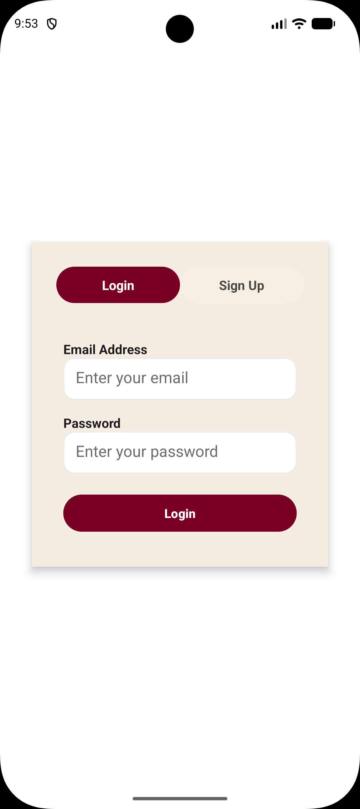
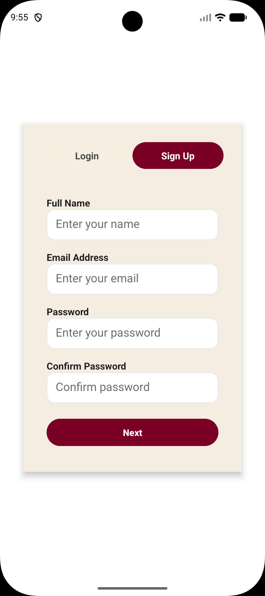
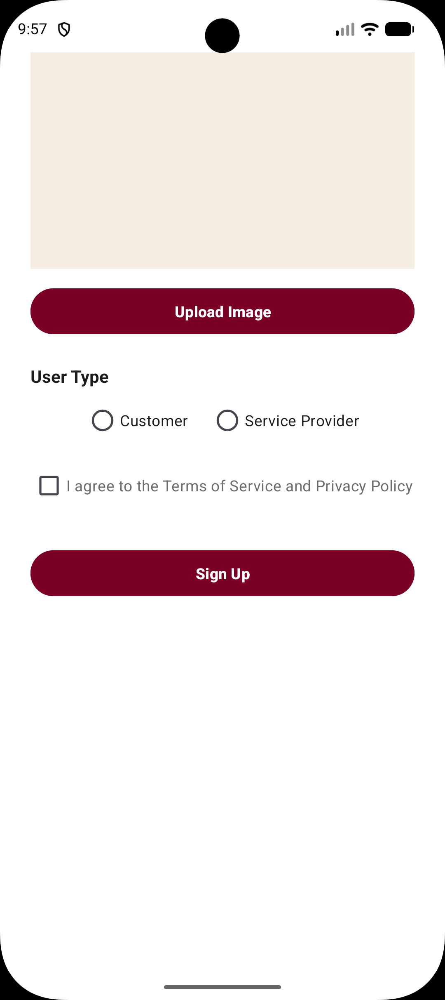
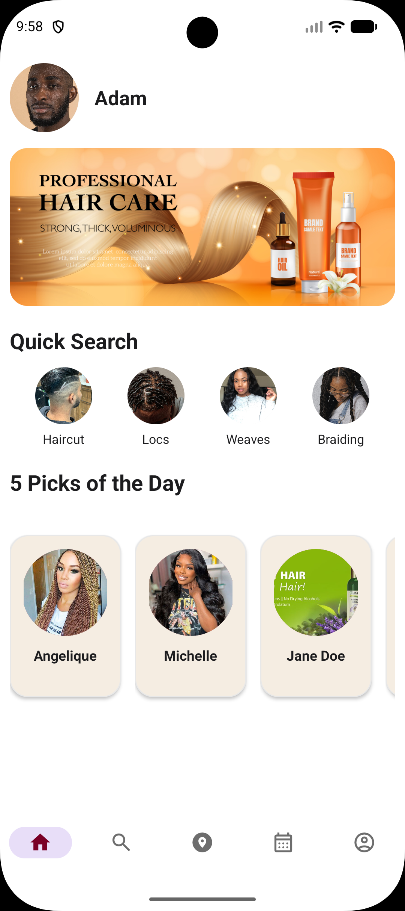
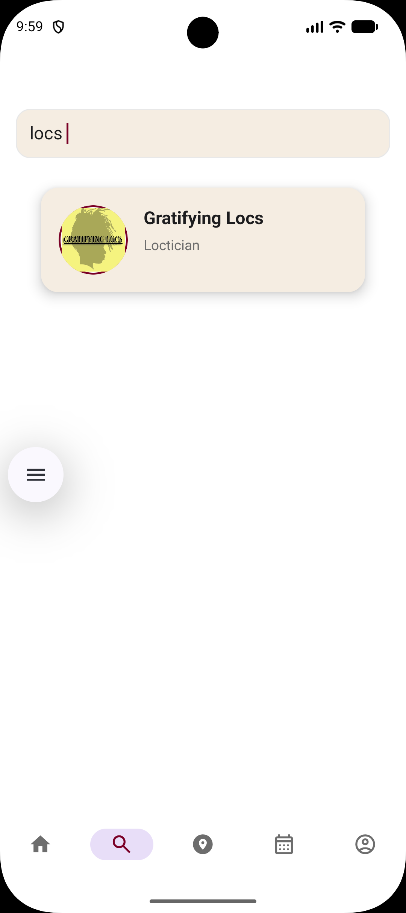
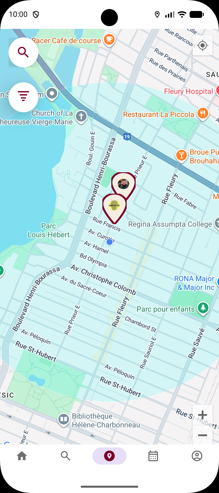
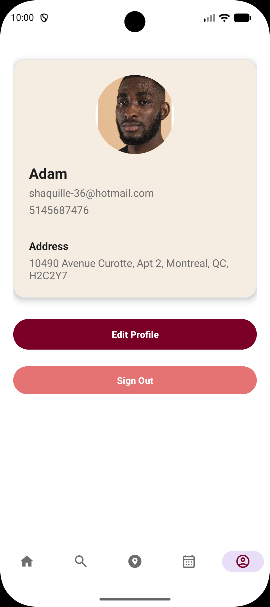
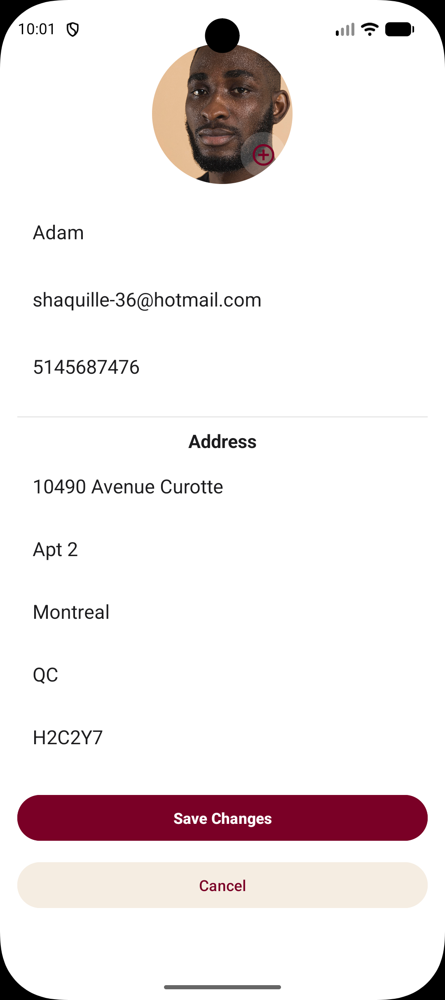

# 📱 The Chair – Beauty & Haircare Booking App


## 📸 Screenshots

<h3>Login & Signup</h3>
<p align="center">
  
  
  
  
</p>

<h3> Home and Search </h3>
<p align="center">
  
  
</p>

<h3>Nearby Map</h3>
<p align="center">
  
</p>


<h3>Bookings</h3>
<p align="center">
  
</p>


<h3>Profile</h3>
<p align="center">
  
  
</p>


---

# 🚀 Features

## Customer Features
- Interactive Google Map with radius filters
- Search by name, profession, service, or tags  
- Directions via external Google Maps  
- Booking lifecycle (pending → accepted → completed → rated)  
- Cancel, rebook, and rate sessions  
- View Today / Upcoming / Past bookings  

## Professional Features
- Edit profile, services, and portfolio  
- Set availability  
- Manage bookings  
- Receive ratings and build reputation  

---

# 🔥 Firebase Integration

### Authentication
Email/password login  

### Firestore Structure

```
Users/{uid}/
    name
    role
    profession
    address{}
    geo
    profilepic
    services[]
    tags[]
    bookings/
    ratings/
```

### Storage
- Profile images  
- Portfolio images  

---

# 🧱 App Architecture

```
/AuthFlow
/Customer
/Professional
/Adapters
/Models
/Utils
```

---

# 🧭 Booking Lifecycle

- pending  
- accepted  
- completed  
- cancelled  

Mirrored data under:

```
Users/{customerId}/bookings/
Users/{professionalId}/bookings/
```

---

# ⭐ Rating System

Weighted formula:

```
newAverage = ((oldRating * count) + newRating) / (count + 1)
```

Stored fields:
```
customerName
customerID
rating
comment
timestamp
```

---

# ⚙️ Installation & Setup

### 1. Clone
```
git clone https://github.com/yourusername/TheChair.git
cd TheChair
```

### 2. Open in Android Studio  
Open → Existing Project → Wait for Gradle Sync

---

# 🔐 API Keys

### Google Maps SDK Key

Enable:
- Maps SDK
- Geocoding API

Add to `local.properties`:

```
MAPS_API_KEY=your_key_here
```

Add to Manifest:

```xml
<meta-data
    android:name="com.google.android.geo.API_KEY"
    android:value="${MAPS_API_KEY}" />
```

---

# 🔥 Firebase Setup

### 1. Create Firebase Project  
Enable Auth, Firestore, Storage

### 2. Download google-services.json  
Place into:

```
/app/google-services.json
```

### 3. Recommended Firestore Rules

```
rules_version = '2';
service cloud.firestore {
  match /databases/{database}/documents {

    match /Users/{userId} {
      allow read: if true;
      allow write: if request.auth != null && request.auth.uid == userId;

      match /bookings/{bookingId} {
        allow read, write: if request.auth != null;
      }

      match /ratings/{ratingId} {
        allow create: if request.auth != null;
      }
    }
  }
}
```

---

# ▶️ Running the App

1. Connect Android device  
2. Enable USB debugging  
3. Run from Android Studio  

---

# ❗ Troubleshooting

### Blank Google Map  
- Incorrect API key  
- Maps SDK disabled  
- Billing disabled  

### Missing pro marker image  
- Storage rule issues  

### Crash tapping marker  
- Missing geo field  

---

# 👥 Contributing

1. Fork  
2. Create feature branch  
3. Commit  
4. Open pull request  

---

# 📄 License  
Copyright, All rights Reserve, property of Shaquille O Neil

